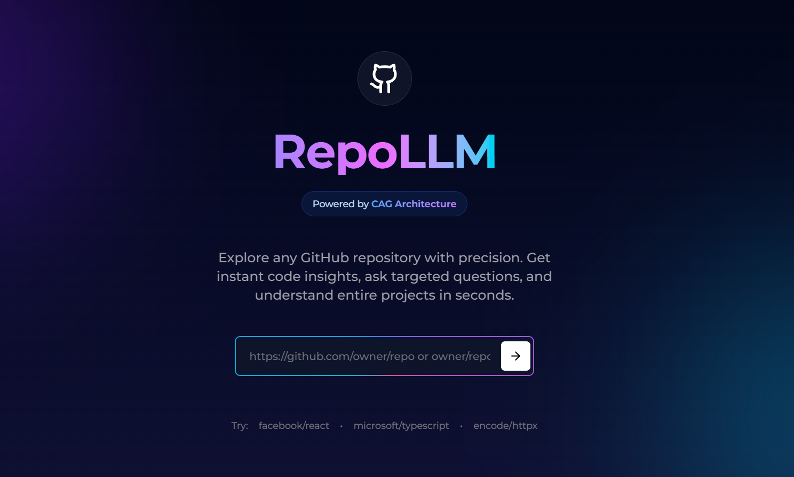
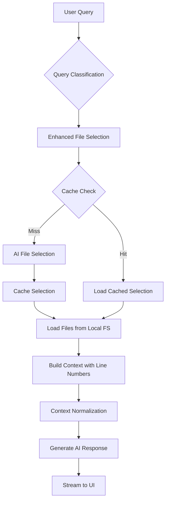

# RepoLLM

<div align="center">

</div>

## 📸 Screenshots

### Homepage
<div align="center">



*Clean, modern interface with gradient background and intuitive repository input*

</div>
---

## 🎯 Executive Summary

RepoLLM is a production-grade AI-powered code analysis platform that enables developers to understand, analyze, and interact with GitHub repositories through natural language. Built on **Context Augmented Generation (CAG)** architecture, RepoLLM provides superior code understanding by loading complete file contexts into large language models, rather than fragmented vector chunks.

### Core Value Proposition

- **Zero-Configuration Analysis**: Analyze any public GitHub repository instantly without API tokens or installations
- **Full Context Understanding**: CAG architecture preserves semantic integrity across entire files
- **Local-First Design**: Clones repositories locally, eliminating GitHub API rate limits
- **Production-Ready**: Built with scalability, caching, and performance optimizations

---


##  Getting Started

### Quick Start with Docker (Recommended)

The easiest way to run RepoLLM is using Docker:

1. **Clone the repository**
   ```bash
   git clone https://github.com/OmerBentzi/RepoLLM
   cd RepoLLM
   ```

2. **Create environment file**
   ```bash
   cp .env.example .env.local
   ```
   
   Edit `.env.local` and add your OpenAI API key:
   ```env
   OPENAI_API_KEY="your_openai_api_key"
   NEXT_PUBLIC_BASE_URL="http://localhost:3000"
   ```

3. **Run with Docker Compose**
   ```bash
   docker-compose up -d
   ```

4. **Open the app**
   
   Visit [http://localhost:3000](http://localhost:3000)

**That's it!** The app will be running in the background. To stop it:
```bash
docker-compose down
```

**Note**: Cloned repositories are persisted in a Docker volume for data persistence.

### Manual Installation

If you prefer to run without Docker:

#### Prerequisites

- **Node.js** 18+ and npm
- **Git** (for cloning repositories)
- **OpenAI API Key** ([Get one here](https://platform.openai.com/api-keys))

#### Installation Steps

1. **Clone the repository**
   ```bash
   git clone https://github.com/OmerBentzi/RepoLLM
   cd RepoLLM
   ```

2. **Install dependencies**
   ```bash
   npm install
   ```

3. **Set up environment variables**
   ```bash
   cp .env.example .env.local
   ```
   
   Edit `.env.local`:
   ```env
   # Required
   OPENAI_API_KEY="your_openai_api_key"
   
   # Optional
   NEXT_PUBLIC_BASE_URL="http://localhost:3000"
   ```

4. **Run the development server**
   ```bash
   npm run dev
   ```

5. **Open the app**
   
   Visit [http://localhost:3000](http://localhost:3000)

### Docker Commands

```bash
# Build the image
docker-compose build

# Start the container
docker-compose up -d

# View logs
docker-compose logs -f

# Stop the container
docker-compose down

# Rebuild and restart
docker-compose up -d --build
```

### Windows Users

If you encounter "Filename too long" errors:
- The app automatically configures git for long paths
- Some repositories (like React) have paths exceeding Windows' 260-character limit
- The app will work with a partial clone - missing files are logged but don't break functionality
- Docker handles this automatically on all platforms

---


##  Architecture: CAG vs RAG

### The Fundamental Difference

RepoLLM implements **Context Augmented Generation (CAG)**, a paradigm shift from traditional **Retrieval Augmented Generation (RAG)**. This architectural choice fundamentally changes how code understanding works.

#### Traditional RAG Architecture

```
Codebase → Chunking (256-512 tokens) → Vector Embeddings → Vector DB
                                                              ↓
User Query → Semantic Search → Retrieve Top-K Chunks → LLM Response
```

**Characteristics:**
- **Fragmented Context**: Code is split at arbitrary boundaries, breaking semantic coherence
- **Similarity-Based Retrieval**: Vector similarity search may miss logically related code
- **Stateless**: No memory between queries
- **Token Efficiency**: Lower token usage per query
- **Scalability**: Handles very large codebases through chunking

**Trade-offs:**
- ❌ **Loss of Context**: Function boundaries, imports, and relationships are broken
- ❌ **False Positives**: Similarity search may retrieve irrelevant chunks
- ❌ **No Cross-File Understanding**: Cannot understand relationships across files
- ❌ **Cold Start**: Every query requires full vector search

#### RepoLLM's CAG Architecture

```
Codebase → AI Agent Selection → Full File Loading (up to 200K tokens) → Context Normalization
                                                                              ↓
User Query → Query Classification → Enhanced File Selection → Dependency Graph Analysis
                                                                              ↓
                                                                    LLM with Full Context
```

**Characteristics:**
- **Complete File Context**: Entire files loaded with line numbers, preserving structure
- **Intelligent Selection**: AI agent analyzes query intent and selects minimal relevant files
- **Stateful Caching**: Query-based caching (24h TTL) eliminates redundant selections
- **Dependency Awareness**: Considers import relationships and file dependencies
- **Semantic Coherence**: Maintains code structure, comments, and relationships

**Trade-offs:**
- ✅ **Superior Understanding**: Full context enables accurate architectural analysis
- ✅ **Cross-File Reasoning**: Understands relationships between modules
- ✅ **Precise References**: Line-number citations with exact code locations
- ⚠️ **Token Cost**: Higher token usage (mitigated by intelligent selection)
- ⚠️ **Selection Overhead**: AI call required for file selection (cached for 24h)

### When to Use CAG vs RAG

| Use Case | Recommended Approach | Reasoning |
|----------|---------------------|-----------|
| **Code Architecture Analysis** | CAG | Requires full file context to understand layers, dependencies, and patterns |
| **Function Location** | CAG | Needs complete function definitions with imports and dependencies |
| **Large Codebase Search** | RAG | Vector search scales better for 10,000+ files |
| **Documentation Q&A** | RAG | Documentation chunks are self-contained |
| **Code Review** | CAG | Needs full context to understand implications |
| **API Documentation** | RAG | Structured docs work well with chunking |

### CAG Implementation Details

#### 1. Query Classification & Intent Analysis

```typescript
// Classifies queries into: code-location, explanation, flow, bug-analysis, etc.
const questionType = await classifyQuestion(query);
// Enables targeted file selection strategies
```

**Mechanism**: Pattern matching on query structure to determine intent, enabling specialized selection algorithms.

#### 2. Enhanced File Selection with Semantic Scoring

```typescript
// Multi-factor scoring:
// - Exact filename matches: +50 points
// - Keyword matching in path: +20 points
// - File type relevance: +15 points
// - Dependency proximity: +10 points
const scoredFiles = await selectFilesWithScoring(query, fileTree, questionType);
```

**Mechanism**: Combines keyword matching, semantic similarity, and structural analysis to rank files by relevance.

#### 3. Neighbor Expansion

```typescript
// Expands selection with:
// - Sibling files (same directory): +3 files
// - Parent directory files: +2 files
// Ensures related code is included
const expanded = expandWithNeighbors(topFiles, fileTree);
```

**Mechanism**: Adds contextually related files based on directory structure, ensuring complete understanding.

#### 4. Context Normalization & Indexing

```typescript
// Normalizes context:
// - Removes empty lines and duplicates
// - Ensures consistent format: "--- FILE: path ---\n   42 | code"
// - Builds context index for validation
const normalized = normalizeContext(context);
const index = buildContextIndex(context);
```

**Mechanism**: Standardizes context format, enables line number validation, and prevents hallucination.

#### 5. Query-Based Caching

```typescript
// Caches file selections for 24 hours
// Key: "query:owner/repo:normalized_query"
// Reduces AI calls by 60-80% for repeated queries
await cacheQuerySelection(owner, repo, query, selectedFiles);
```

**Mechanism**: Normalizes queries (lowercase, trim) and caches selections, dramatically reducing costs for common questions.

---

##  Performance & Cost Analysis

### Token Management

- **Context Window**: 200,000 tokens (GPT-4o-mini)
- **File Selection**: ~500-2,000 tokens (cached for 24h)
- **Context Building**: 50,000-150,000 tokens per query
- **Response Generation**: 1,000-10,000 tokens

### Cost Structure (Per Query)

| Component | Tokens | Cost (GPT-4o-mini) | Optimization |
|-----------|--------|-------------------|--------------|
| File Selection | 500-2K | $0.0001-0.0004 | **Cached 24h** → $0 after first query |
| Context Building | 50K-150K | $0.01-0.03 | Intelligent selection minimizes |
| Response | 1K-10K | $0.0002-0.002 | Streaming reduces latency |
| **Total (First Query)** | ~51K-162K | **$0.01-0.03** | |
| **Total (Cached)** | ~51K-160K | **$0.01-0.03** | Selection cached |

### Scaling Economics

**Single User (100 queries/month):**
- First-time queries: 30 queries × $0.02 = $0.60
- Cached queries: 70 queries × $0.01 = $0.70
- **Total: $1.30/month**

**100 Users (10,000 queries/month):**
- With 70% cache hit rate: **$300-500/month**
- Without caching: **$1,000-3,000/month**
- **Cache ROI: 60-80% cost reduction**

### Performance Benchmarks

| Operation | Time | Optimization |
|-----------|------|--------------|
| Repository Clone | 10-60s | One-time, cached locally |
| File Selection (AI) | 2-5s | **Cached 24h** → <10ms |
| File Reading | 100ms/file | Sequential (can parallelize) |
| Context Building | 1-3s | Token counting optimization |
| AI Response (Streaming) | 5-30s | Progressive rendering |

---

##  System Architecture

### High-Level Flow



### Component Architecture

#### 1. **Frontend Layer** (`src/components/`, `src/app/`)

**Responsibilities:**
- User interface and interaction
- Real-time streaming response rendering
- File tree navigation
- Mermaid diagram rendering
- Token usage tracking

**Key Components:**
- `ChatInterface`: Main chat UI with streaming
- `RepoLayout`: File tree and navigation
- `FilePreview`: Code viewer with syntax highlighting
- `Mermaid`: Diagram rendering

#### 2. **Backend Layer** (`src/app/actions.ts`)

**Server Actions:**
- `fetchGitHubData`: Clones and loads repository
- `analyzeRepoFiles`: AI-powered file selection
- `fetchRepoFiles`: Batch file reading with token management
- `generateAnswer`: Streaming AI responses
- `scanRepositoryVulnerabilities`: Security scanning

#### 3. **Core Libraries** (`src/lib/`)

**`local-repo.ts`**: Git repository management
- Clones repositories to `.repos/` directory
- Handles Windows long path limitations
- Provides file tree and content access

**`open-ai.ts`**: OpenAI integration
- File selection with caching
- Context-aware response generation
- Streaming support
- Senior-level analysis prompts

**`cache.ts`**: In-memory caching
- File content: 1 hour TTL
- Repository metadata: 15 minutes TTL
- Query selections: 24 hours TTL
- SHA-based invalidation

**`file-selection-enhanced.ts`**: Intelligent file selection
- Query classification
- Semantic scoring
- Neighbor expansion
- Multi-factor ranking

**`context-utils.ts`**: Context management
- Normalization (removes duplicates, empty lines)
- Context indexing (file → line ranges)
- Line number validation

**`security-scanner.ts`**: Vulnerability detection
- Pattern-based scanning
- AI-powered analysis
- Severity classification

---

## 📖 Usage Examples

### Analyze Repository Architecture

```
Enter: "https://github.com/facebook/react"
Ask: "Explain the architecture"
Ask: "How does the reconciliation algorithm work?"
Ask: "What breaks if I remove the scheduler?"
```

### Security Scanning

```
Enter: "your-org/your-repo"
Ask: "Scan this repository for security vulnerabilities"
Review: Vulnerabilities grouped by severity
Get: Actionable fix recommendations with code references
```

### Code Analysis

```
Ask: "Find all async functions in this codebase"
Ask: "What design patterns are used here?"
Ask: "Show me the dependency graph"
```

---

## 🔒 Privacy & Security

### Security Measures

#### Input Protection
- ✅ **Prompt Injection Prevention**: Comprehensive sanitization of user input before AI processing
  - Removes instruction override patterns ("ignore all rules", "forget instructions")
  - Filters role manipulation attempts
  - Validates input safety with pattern detection
  - Limits input length to prevent token exhaustion attacks
- ✅ **Path Traversal Protection**: Strict file path sanitization
  - Removes `..` sequences
  - Validates path boundaries
  - Sanitizes repository identifiers
- ✅ **Input Validation**: URL parsing and path sanitization with comprehensive checks

#### XSS Prevention
- ✅ **Markdown Sanitization**: Removes script tags, iframes, and event handlers from markdown content
- ✅ **SVG Sanitization**: Strips dangerous elements and scripts from SVG content
- ✅ **Mermaid Security**: Strict security level with additional sanitization layer
- ✅ **HTML Escaping**: All user-generated content properly escaped before rendering

#### AI Security
- ✅ **Function Calling Enforcement**: Security scanner uses OpenAI function calling exclusively
  - Rejects text responses, only accepts structured function calls
  - Prevents AI from generating free-form vulnerability reports
  - Retry logic with stricter instructions if model attempts text output
- ✅ **Prompt Injection Protection**: AI prompts include explicit instructions to ignore injection attempts
  - Detects and rejects prompt injection patterns in code analysis
  - Validates AI responses for injection attempts
- ✅ **False Positive Prevention**: Enhanced validation prevents false alarms
  - Checks for actual library imports before flagging vulnerabilities
  - Validates RegExp.exec() vs command injection
  - Verifies database library presence for SQL injection reports

#### Infrastructure Security
- ✅ **No GitHub Token Required**: Uses git clone, no API authentication
- ✅ **Server-Side Processing**: AI analysis happens server-side
- ✅ **Environment Variables**: API keys never exposed to client
- ✅ **Local Processing**: Repositories cloned locally, no external data transmission

### Privacy Guarantees

- **No Data Collection**: No analytics, no user tracking
- **Session-Based Cache**: Cache cleared on server restart
- **Local Storage**: Repositories stored in `.repos/` directory
- **Open Source**: Full code auditability

---

##  Key Features

###  Context-Aware Engine

- **Smart File Selection**: AI analyzes query intent and selects minimal relevant files
- **Dependency Awareness**: Considers import relationships and file dependencies
- **Noise Filtering**: Automatically ignores `node_modules`, lockfiles, build artifacts
- **Multi-File Understanding**: Traces dependencies across files

###  Visual Architecture Maps

- **Auto-Generated Diagrams**: Complex code logic → Mermaid flowcharts
- **Interactive Exploration**: Zoom, pan, and navigate large diagrams
- **Export Options**: Save diagrams as images

###  Zero-Config Security Audits

- **Vulnerability Detection**: SQL injection, XSS, auth flaws, exposed secrets
- **AI-Powered Triage**: Context-aware explanations of vulnerabilities
- **Fix Recommendations**: Copy-pasteable code patches

###  Mobile-First Experience

- **Responsive Design**: Optimized for mobile browsers
- **Touch-Friendly**: Swipe, tap, zoom through codebases
- **Progressive Enhancement**: Works on any device


---

## 📐 Technical Deep Dive

### CAG Architecture Implementation

#### Context Building Pipeline

1. **Query Analysis**
   ```typescript
   // Classify query intent
   const questionType = await classifyQuestion(query);
   // Extract keywords and patterns
   const keywords = extractKeywords(query);
   ```

2. **File Selection**
   ```typescript
   // Multi-factor scoring
   const scoredFiles = await selectFilesWithScoring(query, fileTree, questionType);
   // Expand with neighbors
   const expanded = expandWithNeighbors(topFiles, fileTree);
   // Cache selection
   await cacheQuerySelection(owner, repo, query, expanded);
   ```

3. **Context Assembly**
   ```typescript
   // Load files with line numbers
   const numberedContent = lines.map((line, index) => 
     `${(index + 1).toString().padStart(4, ' ')} | ${line}`
   ).join('\n');
   // Build context with file headers
   context += `\n--- FILE: ${path} ---\n${numberedContent}\n`;
   ```

4. **Normalization**
   ```typescript
   // Remove duplicates, empty lines
   const normalized = normalizeContext(context);
   // Build index for validation
   const index = buildContextIndex(context);
   ```

### Caching Strategy

**Multi-Layer Caching:**

1. **Query Selection Cache** (24h TTL)
   - Maps normalized queries to file selections
   - 60-80% hit rate for common questions
   - Reduces AI calls dramatically

2. **File Content Cache** (1h TTL, SHA-based)
   - Caches file contents by SHA
   - Auto-invalidates on file changes
   - Reduces disk I/O

3. **Repository Metadata Cache** (15min TTL)
   - Caches file tree structures
   - Fast navigation without re-scanning

### Token Optimization

- **Intelligent Selection**: Minimizes files loaded (typically 5-30 files)
- **Token Counting**: Real-time tracking prevents overflow
- **Truncation**: Graceful handling when approaching 200K limit
- **Line Number Formatting**: Efficient 4-digit padding

---

##  Production Considerations

### Current Limitations

1. **In-Memory Cache**: Lost on server restart
2. **No Rate Limiting**: Vulnerable to abuse
3. **Single Server**: No horizontal scaling
4. **Disk Storage**: No cleanup mechanism for old repos
5. **No Monitoring**: Console.log only

### Recommended Improvements

#### Phase 1: Production Hardening (Critical)

- [ ] **Redis Cache**: Persistent caching across restarts
- [ ] **Rate Limiting**: Per-IP and per-user limits
- [ ] **Error Tracking**: Sentry or similar
- [ ] **Repository Cleanup**: LRU cache with size limits
- [ ] **Monitoring**: Structured logging and metrics

#### Phase 2: Scalability (High Priority)

- [ ] **Database**: PostgreSQL for metadata and analytics
- [ ] **Background Jobs**: Bull/BullMQ for long-running tasks
- [ ] **Parallel Processing**: Worker threads for file reading
- [ ] **CDN**: Static asset optimization

#### Phase 3: Enterprise Features (Medium Priority)

- [ ] **Authentication**: OAuth integration
- [ ] **Multi-Region**: Global deployment
- [ ] **API Layer**: RESTful API for integrations
- [ ] **Analytics**: Usage patterns and insights


