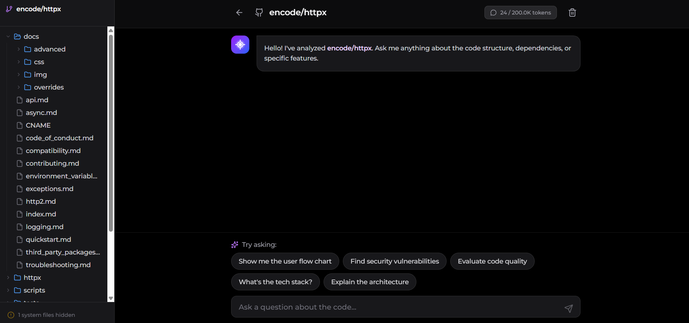
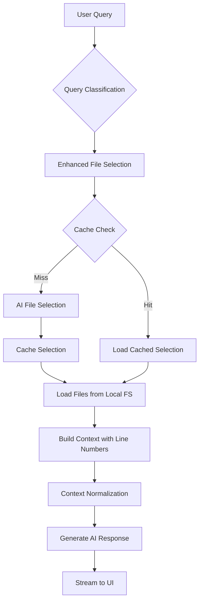

# RepoLLM

<div align="center">


</div>

<div align="center">




</div>


##  Executive Summary

RepoLLM is a production-grade AI-powered code analysis platform that enables developers to understand, analyze, and interact with GitHub repositories through natural language. Built on **Context Augmented Generation (CAG)** architecture, RepoLLM provides superior code understanding by loading complete file contexts into large language models, rather than fragmented vector chunks.

### Core Value Proposition

- **Zero-Configuration Analysis**: Analyze any public GitHub repository instantly without API tokens or installations
- **Full Context Understanding**: CAG architecture preserves semantic integrity across entire files
- **Local-First Design**: Clones repositories locally, eliminating GitHub API rate limits
- **Production-Ready**: Built with scalability, caching, and performance optimizations

---


##  Getting Started

### Quick Start with Docker (Recommended)

The easiest way to run RepoLLM is using Docker:

1. **Clone the repository**
   ```bash
   git clone https://github.com/OmerBentzi/RepoLLM
   cd RepoLLM
   ```

2. **Create environment file**
   ```bash
   cp .env.example .env.local
   ```
   
   Edit `.env.local` and add your OpenAI API key:
   ```env
   OPENAI_API_KEY="your_openai_api_key"
   NEXT_PUBLIC_BASE_URL="http://localhost:3000"
   ```

3. **Run with Docker Compose**
   ```bash
   docker-compose up -d
   ```

4. **Open the app**
   
   Visit [http://localhost:3000](http://localhost:3000)

**That's it!** The app will be running in the background. To stop it:
```bash
docker-compose down
```

**Note**: Cloned repositories are persisted in a Docker volume for data persistence.

### Manual Installation

If you prefer to run without Docker:

#### Prerequisites

- **Node.js** 18+ and npm
- **Git** (for cloning repositories)
- **OpenAI API Key** ([Get one here](https://platform.openai.com/api-keys))

#### Installation Steps

1. **Clone the repository**
   ```bash
   git clone https://github.com/OmerBentzi/RepoLLM
   cd RepoLLM
   ```

2. **Install dependencies**
   ```bash
   npm install
   ```

3. **Set up environment variables**
   ```bash
   cp .env.example .env.local
   ```
   
   Edit `.env.local`:
   ```env
   # Required
   OPENAI_API_KEY="your_openai_api_key"
   
   # Optional
   NEXT_PUBLIC_BASE_URL="http://localhost:3000"
   ```

4. **Run the development server**
   ```bash
   npm run dev
   ```

5. **Open the app**
   
   Visit [http://localhost:3000](http://localhost:3000)

### Docker Commands

```bash
# Build the image
docker-compose build

# Start the container
docker-compose up -d

# View logs
docker-compose logs -f

# Stop the container
docker-compose down

# Rebuild and restart
docker-compose up -d --build
```

### Windows Users

If you encounter "Filename too long" errors:
- The app automatically configures git for long paths
- Some repositories (like React) have paths exceeding Windows' 260-character limit
- The app will work with a partial clone - missing files are logged but don't break functionality
- Docker handles this automatically on all platforms

---


##  Architecture: CAG vs RAG

### The Fundamental Difference

RepoLLM implements **Context Augmented Generation (CAG)**, a paradigm shift from traditional **Retrieval Augmented Generation (RAG)**. This architectural choice fundamentally changes how code understanding works.

#### Traditional RAG Architecture

```
Codebase → Chunking (256-512 tokens) → Vector Embeddings → Vector DB
                                                              ↓
User Query → Semantic Search → Retrieve Top-K Chunks → LLM Response
```

**Characteristics:**
- **Fragmented Context**: Code is split at arbitrary boundaries, breaking semantic coherence
- **Similarity-Based Retrieval**: Vector similarity search may miss logically related code
- **Stateless**: No memory between queries
- **Token Efficiency**: Lower token usage per query
- **Scalability**: Handles very large codebases through chunking

**Trade-offs:**
-  **Loss of Context**: Function boundaries, imports, and relationships are broken
-  **False Positives**: Similarity search may retrieve irrelevant chunks
-  **No Cross-File Understanding**: Cannot understand relationships across files
-  **Cold Start**: Every query requires full vector search

#### RepoLLM's CAG Architecture

```
Codebase → AI Agent Selection → Full File Loading (up to 200K tokens) → Context Normalization
                                                                              ↓
User Query → Query Classification → Enhanced File Selection → Dependency Graph Analysis
                                                                              ↓
                                                                    LLM with Full Context
```

**Characteristics:**
- **Complete File Context**: Entire files loaded with line numbers, preserving structure
- **Intelligent Selection**: AI agent analyzes query intent and selects minimal relevant files
- **Stateful Caching**: Query-based caching (24h TTL) eliminates redundant selections
- **Dependency Awareness**: Considers import relationships and file dependencies
- **Semantic Coherence**: Maintains code structure, comments, and relationships

**Trade-offs:**
-  **Superior Understanding**: Full context enables accurate architectural analysis
-  **Cross-File Reasoning**: Understands relationships between modules
-  **Precise References**: Line-number citations with exact code locations
-  **Token Cost**: Higher token usage (mitigated by intelligent selection)
-  **Selection Overhead**: AI call required for file selection (cached for 24h)

### When to Use CAG vs RAG

| Use Case | Recommended Approach | Reasoning |
|----------|---------------------|-----------|
| **Code Architecture Analysis** | CAG | Requires full file context to understand layers, dependencies, and patterns |
| **Function Location** | CAG | Needs complete function definitions with imports and dependencies |
| **Large Codebase Search** | RAG | Vector search scales better for 10,000+ files |
| **Documentation Q&A** | RAG | Documentation chunks are self-contained |
| **Code Review** | CAG | Needs full context to understand implications |
| **API Documentation** | RAG | Structured docs work well with chunking |

### CAG Implementation Details

#### 1. Query Classification & Intent Analysis

```typescript
// Classifies queries into: code-location, explanation, flow, bug-analysis, etc.
const questionType = await classifyQuestion(query);
// Enables targeted file selection strategies
```

**Mechanism**: Pattern matching on query structure to determine intent, enabling specialized selection algorithms.

#### 2. Enhanced File Selection with Semantic Scoring

```typescript
// Multi-factor scoring:
// - Exact filename matches: +50 points
// - Keyword matching in path: +20 points
// - File type relevance: +15 points
// - Dependency proximity: +10 points
const scoredFiles = await selectFilesWithScoring(query, fileTree, questionType);
```

**Mechanism**: Combines keyword matching, semantic similarity, and structural analysis to rank files by relevance.

#### 3. Neighbor Expansion

```typescript
// Expands selection with:
// - Sibling files (same directory): +3 files
// - Parent directory files: +2 files
// Ensures related code is included
const expanded = expandWithNeighbors(topFiles, fileTree);
```

**Mechanism**: Adds contextually related files based on directory structure, ensuring complete understanding.

#### 4. Context Normalization & Indexing

```typescript
// Normalizes context:
// - Removes empty lines and duplicates
// - Ensures consistent format: "--- FILE: path ---\n   42 | code"
// - Builds context index for validation
const normalized = normalizeContext(context);
const index = buildContextIndex(context);
```

**Mechanism**: Standardizes context format, enables line number validation, and prevents hallucination.

#### 5. Query-Based Caching

```typescript
// Caches file selections for 24 hours
// Key: "query:owner/repo:normalized_query"
// Reduces AI calls by 60-80% for repeated queries
await cacheQuerySelection(owner, repo, query, selectedFiles);
```

**Mechanism**: Normalizes queries (lowercase, trim) and caches selections, dramatically reducing costs for common questions.

---


##  System Architecture

### High-Level Flow



### Component Architecture

#### 1. **Frontend Layer** (`src/components/`, `src/app/`)

**Responsibilities:**
- User interface and interaction
- Real-time streaming response rendering
- File tree navigation
- Mermaid diagram rendering
- Token usage tracking

**Key Components:**
- `ChatInterface`: Main chat UI with streaming
- `RepoLayout`: File tree and navigation
- `FilePreview`: Code viewer with syntax highlighting
- `Mermaid`: Diagram rendering

#### 2. **Backend Layer** (`src/app/actions.ts`)

**Server Actions:**
- `fetchGitHubData`: Clones and loads repository
- `analyzeRepoFiles`: AI-powered file selection
- `fetchRepoFiles`: Batch file reading with token management
- `generateAnswer`: Streaming AI responses
- `scanRepositoryVulnerabilities`: Security scanning

#### 3. **Core Libraries** (`src/lib/`)

**`local-repo.ts`**: Git repository management
- Clones repositories to `.repos/` directory
- Handles Windows long path limitations
- Provides file tree and content access

**`open-ai.ts`**: OpenAI integration
- File selection with caching
- Context-aware response generation
- Streaming support
- Senior-level analysis prompts

**`cache.ts`**: In-memory caching
- File content: 1 hour TTL
- Repository metadata: 15 minutes TTL
- Query selections: 24 hours TTL
- SHA-based invalidation

**`file-selection-enhanced.ts`**: Intelligent file selection
- Query classification
- Semantic scoring
- Neighbor expansion
- Multi-factor ranking

**`context-utils.ts`**: Context management
- Normalization (removes duplicates, empty lines)
- Context indexing (file → line ranges)
- Line number validation

**`security-scanner.ts`**: Vulnerability detection
- Pattern-based scanning
- AI-powered analysis
- Severity classification

---

##  Usage Examples

### Real-World Example: Analyzing httpx

Here are example queries for the [httpx](https://github.com/encode/httpx) repository with actual answers and code citations:

#### Example 1: Understanding the Client Class

**Query:** "How does the Client class handle HTTP requests?"

**Answer:**

The Client class in httpx manages HTTP requests through several interconnected components and methods. Below is a breakdown of its architecture and workflow, strictly adhering to the code from the repository.

**High-Level Architecture**

**Layered Structure:**
- **Transport Layer**: Encapsulated in `BaseTransport` and its subclasses (`HTTPTransport` and `AsyncHTTPTransport`) which handle the actual sending of requests and receiving of responses. This is where low-level HTTP interaction occurs. [file:httpx/_transports/base.py:14-35]
- **Client Layer**: The `Client` class itself which manages configuration (like headers, authentication) and implements the logic for making requests. [file:httpx/_client.py:594-600]

**Components Responsible:**
- Client is responsible for building requests, handling session state, and managing configuration.
- The transport layer is responsible for executing those requests and interacting with the network.

**Lifecycle Explanation**

1. **Request Creation**: When a request is initiated using methods like `get`, `post`, etc., it begins by calling the `request` method. [file:httpx/_client.py:771-796] The parameters provided are merged with the default values set in the Client instance. This is done through the `build_request` method. [file:httpx/_client.py:340-389]

2. **Handling Request**: After building the request, it is sent to the transport layer via the `send` method. Here, the request is sent without modification and may utilize a `MockTransport` for tests or the actual `HTTPTransport`. [file:httpx/_client.py:879-924]

3. **Transport Communication**: Under the hood, the transport layer (`HTTPTransport` or `AsyncHTTPTransport`) interacts with the network. The `handle_request` method dispatches the actual HTTP request. [file:httpx/_transports/base.py:26-40]

4. **Response Handling**: The response is returned and can be sanitized and wrapped in a `Response` object, which provides methods to handle data (like JSON parsing). The content can be extracted using methods like `.iter_bytes()`, `.read()`, or `.json()` based on user needs. [file:httpx/_models.py:516-640]

**Component Interactions**

- `request` calls `build_request`, which then invokes `send`. This flow continuously iterates through methods in the Client class leveraging the transport layer for handling the low-level details of HTTP communication.
- The transport for the URL is determined based on configured mounts or defaults. [file:httpx/_transports/base.py:234-259]
- Internal states within the Client such as the authentication and sessions are handled through properties, ensuring that each request can maintain proper context of session and associated configurations. [file:httpx/_client.py:189-220]

**Edge Cases & Pitfalls**

- **Error Handling**: The Client class includes error handling mechanisms via exceptions like `RequestError` and `HTTPStatusError`. Decisions based on response status codes can raise exceptions for 4xx and 5xx codes, ensuring that users manage errors appropriately. [file:httpx/_exceptions.py:74-268]
- **Streaming vs Non-Streaming**: Differentiate between streaming and non-streaming operations; entities in response can be accessed in various ways which can lead to errors if not managed correctly, such as attempting to read the content after it has been consumed. [file:httpx/_models.py:940-966]

**Files Analyzed:**
- `httpx/_client.py` - lines 189-220, 340-389, 594-600, 771-796, 879-924
- `httpx/_transports/base.py` - lines 14-35, 26-40, 234-259
- `httpx/_models.py` - lines 516-640, 940-966
- `httpx/_exceptions.py` - lines 74-268

---

#### Example 2: Authentication Mechanism

**Query:** "How does httpx handle authentication?"

**Answer:**

HTTPX handles authentication through a series of classes and mechanisms that encapsulate different authentication schemes. The primary structure supporting authentication is based on the `Auth` class and its various subclasses.

**High-Level Architecture**

**Core Classes:**
- **Auth**: The base class for all authentication schemes. It defines a common interface and the basic functionality for handling authentication flows. [file:httpx/_auth.py:22-32]
- **BasicAuth, DigestAuth, NetRCAuth**: Subclasses of `Auth` that implement specific authentication protocols.
  - `BasicAuth` handles HTTP Basic Authentication. [file:httpx/_auth.py:126-142]
  - `DigestAuth` implements HTTP Digest Authentication. [file:httpx/_auth.py:175-327]
  - `NetRCAuth` uses credentials from a `.netrc` file for authentication. [file:httpx/_auth.py:145-165]

**Lifecycle Explanation**

1. **Authentication Flow**: Each authentication class implements the `auth_flow` method that defines how authentication is applied to a request. For example, in `BasicAuth`, the `auth_flow` method adds the `Authorization` header to the request. [file:httpx/_auth.py:135-137]

2. **Client Configuration**: When initializing a `Client`, the `auth` parameter can be set to an instance of any authentication class, allowing it to be used for all requests made by that client. This is handled in the Client's constructor where `_build_auth` processes the auth parameter. [file:httpx/_client.py:188-210]

3. **Making Requests with Authentication**: When a request is made using methods like `get`, `post`, etc., the client prepares the request and retrieves the authentication to be applied by calling the `_build_request_auth` method, which integrates the authentication instance. [file:httpx/_client.py:458-467]

**Component Interactions**

- The `Client` interacts with the various `Auth` subclasses when sending requests. For example, upon calling `send`, the method fetches the appropriate auth to be used, enabling the request context to include the necessary authentication header. [file:httpx/_client.py:912-917]

**Internals**

- **Storing Credentials**: The `BasicAuth` class, for instance, constructs the authorization header by encoding the username and password using Base64. This is done in the `_build_auth_header` method. [file:httpx/_auth.py:139-142]
- **Error Handling**: HTTPX manages errors that can occur during authentication through the `HTTPError` exceptions, specifically if the server responds with a 401 Unauthorized status code. [file:httpx/_exceptions.py:74-268]

**Summary**

HTTPX efficiently handles authentication by providing a flexible and extensible architecture that can accommodate various authentication schemes. With solid encapsulation in the `Auth` classes and integration into the request lifecycle via the `Client`, it allows developers to implement secure HTTP interactions seamlessly.

**Files Analyzed:**
- `httpx/_auth.py` - lines 22-32, 126-142, 135-137, 139-142, 145-165, 175-327
- `httpx/_client.py` - lines 188-210, 458-467, 912-917
- `httpx/_exceptions.py` - lines 74-268

---

#### Example 3: Connection Pooling

**Query:** "How does connection pooling work in httpx?"

**Answer:**

Connection pooling in httpx is handled primarily by the `HTTPTransport` class, which manages a pool of connections for efficient reuse.

**High-Level Architecture**

- **Transport Layer**: The `HTTPTransport` class is responsible for managing the connection pool. When a new request is made, `HTTPTransport` will either reuse an existing connection or establish a new one if none are available. [file:httpx/_transports/default.py:135-166]
- **Connection Pooling Logic**: Inside `HTTPTransport`, a `ConnectionPool` is created to hold the active connections, ensuring that connections are reused for requests with the same parameters, thus improving performance. This is configured with maximum connection limits, timeouts, and expiration settings. [file:httpx/_transports/default.py:150-166]

**Lifecycle Explanation**

1. **Pool Initialization**: When the `Client` is instantiated, the transport initializes the connection pool with specified limits such as maximum connections and keep-alive settings. [file:httpx/_client.py:661-715]

2. **Request Handling**: Upon making a request, the `handle_request` method checks if there are available connections in the pool. If not, new connections are created. The key logic here is to maintain a pool of live connections that can be quickly accessed. [file:httpx/_transports/default.py:230-260]

3. **Connection Reuse**: Each request checks the connection pool to see if a connection can be reused. If a connection exists that matches the parameters of the request, it will be reused. This minimizes the overhead of establishing a new connection for each request. [file:httpx/_transports/base.py:30-48]

4. **Cleanup**: When the client is closed or the connections are no longer needed, the pool is also closed, effectively releasing all network resources. This happens in the `close` method of the `HTTPTransport` and `Client` classes. [file:httpx/_client.py:1263-1274] [file:httpx/_transports/base.py:260-261]

**Component Interactions**

- **Client and Transport Interaction**: The `Client` calls methods of `HTTPTransport` when sending requests. For example, it calls `handle_request()` where the pooling logic is invoked to obtain a connection. [file:httpx/_client.py:231-259]
- **Event Hooks**: Event hooks allow for a more advanced interaction if required (like logging or modifying requests), providing an extensible way to manage connections and resources during the request lifecycle. [file:httpx/_client.py:215-220]

**Key Implementation Locations**

Connection pooling is mainly handled in the `HTTPTransport` constructor and its methods:
- [file:httpx/_transports/default.py:135-166]
- [file:httpx/_transports/base.py:30-48]

**Summary**

Connection pooling in httpx optimizes network resource usage by reusing connections across requests, significantly reducing latency associated with establishing new connections. The pooling mechanism is intrinsically tied to the transport layer, which manages the lifecycle of connections based on defined limits and protocols.

**Files Analyzed:**
- `httpx/_transports/default.py` - lines 135-166, 150-166, 230-260
- `httpx/_transports/base.py` - lines 30-48, 260-261
- `httpx/_client.py` - lines 215-220, 231-259, 661-715, 1263-1274

---

#### Example 4: Error Handling

**Query:** "What exceptions can httpx raise and when?"

**Answer:**

The httpx library raises various exceptions depending on the context of HTTP requests and responses. Below is a list of key exceptions and the circumstances under which they are raised, as found in the code.

**Exception Hierarchy**

**HTTPError** [file:httpx/_exceptions.py:74]
- Description: Base class for all HTTP-related errors
- When: Raised during any HTTP error scenario, particularly when a request fails

**RequestError** (inherits from HTTPError) [file:httpx/_exceptions.py:108]
- Description: Base class for exceptions that occur while issuing a request
- When: Raised for all types of request issues, including network failures

**TransportError** (inherits from RequestError) [file:httpx/_exceptions.py:123]
- Description: Base class for transport-related errors
- When: Raised for lower-level transport issues, like connection timeouts

**TimeoutException** (inherits from TransportError) [file:httpx/_exceptions.py:132]
- Description: Raised when a timeout occurs
- When: Specifically for timeout scenarios when waiting for a response or connection
- **Subclasses:**
  - `ConnectTimeout`: Raised when a connection times out. [file:httpx/_exceptions.py:140]
  - `ReadTimeout`: Raised when reading data times out. [file:httpx/_exceptions.py:146]
  - `WriteTimeout`: Raised when writing data times out. [file:httpx/_exceptions.py:152]
  - `PoolTimeout`: Raised when acquiring a connection from the pool times out. [file:httpx/_exceptions.py:158]

**NetworkError** (inherits from TransportError) [file:httpx/_exceptions.py:167]
- Description: Base class for network-related errors
- When: Used for errors occurring while communicating over the network
- **Subclasses:**
  - `ConnectError`: Raised when a connection can't be established. [file:httpx/_exceptions.py:187]
  - `ReadError`: Raised when data cannot be read from the network. [file:httpx/_exceptions.py:175]
  - `WriteError`: Raised when data cannot be sent over the network. [file:httpx/_exceptions.py:181]
  - `CloseError`: Raised when a connection fails to close properly. [file:httpx/_exceptions.py:193]

**ProtocolError** (inherits from TransportError) [file:httpx/_exceptions.py:216]
- Description: Raised when the HTTP protocol is violated
- When: Raised due to issues like missing headers or invalid HTTP responses
- **Subclasses:**
  - `LocalProtocolError`: Raised for protocol violations by the client. [file:httpx/_exceptions.py:222]
  - `RemoteProtocolError`: Raised for protocol violations by the server. [file:httpx/_exceptions.py:232]

**DecodingError** (inherits from RequestError) [file:httpx/_exceptions.py:243]
- Description: Raised when decoding the response fails due to malformed content
- When: Occurs during response processing when the data format is not as expected

**TooManyRedirects** (inherits from RequestError) [file:httpx/_exceptions.py:249]
- Description: Raised when too many redirects are encountered
- When: If the number of redirects exceeds a predefined limit

**InvalidURL** [file:httpx/_exceptions.py:258]
- Description: Raised when an invalid URL is provided
- When: Occurs during URL parsing or validation processes

**CookieConflict** [file:httpx/_exceptions.py:275]
- Description: Raised when there is a conflict in cookies for the same name
- When: Happens when attempting to retrieve a cookie that has multiple values

**StreamError** (inherits from RuntimeError) [file:httpx/_exceptions.py:297]
- Description: Base class for errors related to stream handling
- When: Indicates issues related to incorrect usage of stream operations
- **Subclasses:**
  - `StreamConsumed`: Raised when trying to read from a stream that has already been consumed. [file:httpx/_exceptions.py:309]
  - `StreamClosed`: Raised when attempting to read from a closed stream. [file:httpx/_exceptions.py:327]
  - `ResponseNotRead`: Raised when accessing response content without calling `read()`. [file:httpx/_exceptions.py:338]
  - `RequestNotRead`: Raised when accessing request content without calling `read()`. [file:httpx/_exceptions.py:351]

**Summary**

This hierarchy allows httpx to provide clear and structured error reporting, giving developers the information needed to handle various scenarios effectively.

**Files Analyzed:**
- `httpx/_exceptions.py` - lines 74, 108, 123, 132, 140, 146, 152, 158, 167, 175, 181, 187, 193, 216, 222, 232, 243, 249, 258, 275, 297, 309, 327, 338, 351

---

### General Usage Examples

#### Analyze Repository Architecture

```
Enter: "https://github.com/facebook/react"
Ask: "Explain the architecture"
Ask: "How does the reconciliation algorithm work?"
Ask: "What breaks if I remove the scheduler?"
```

#### Security Scanning

```
Enter: "your-org/your-repo"
Ask: "Scan this repository for security vulnerabilities"
Review: Vulnerabilities grouped by severity
Get: Actionable fix recommendations with code references
```

#### Code Analysis

```
Ask: "Find all async functions in this codebase"
Ask: "What design patterns are used here?"
Ask: "Show me the dependency graph"
```

---

##  Privacy & Security

### Security Measures

#### Input Protection
-  **Prompt Injection Prevention**: Comprehensive sanitization of user input before AI processing
  - Removes instruction override patterns ("ignore all rules", "forget instructions")
  - Filters role manipulation attempts
  - Validates input safety with pattern detection
  - Limits input length to prevent token exhaustion attacks
-  **Path Traversal Protection**: Strict file path sanitization
  - Removes `..` sequences
  - Validates path boundaries
  - Sanitizes repository identifiers
-  **Input Validation**: URL parsing and path sanitization with comprehensive checks

#### XSS Prevention
-  **Markdown Sanitization**: Removes script tags, iframes, and event handlers from markdown content
-  **SVG Sanitization**: Strips dangerous elements and scripts from SVG content
-  **Mermaid Security**: Strict security level with additional sanitization layer
-  **HTML Escaping**: All user-generated content properly escaped before rendering

#### AI Security
-  **Function Calling Enforcement**: Security scanner uses OpenAI function calling exclusively
  - Rejects text responses, only accepts structured function calls
  - Prevents AI from generating free-form vulnerability reports
  - Retry logic with stricter instructions if model attempts text output
-  **Prompt Injection Protection**: AI prompts include explicit instructions to ignore injection attempts
  - Detects and rejects prompt injection patterns in code analysis
  - Validates AI responses for injection attempts
-  **False Positive Prevention**: Enhanced validation prevents false alarms
  - Checks for actual library imports before flagging vulnerabilities
  - Validates RegExp.exec() vs command injection
  - Verifies database library presence for SQL injection reports

#### Infrastructure Security
-  **No GitHub Token Required**: Uses git clone, no API authentication
-  **Server-Side Processing**: AI analysis happens server-side
-  **Environment Variables**: API keys never exposed to client
-  **Local Processing**: Repositories cloned locally, no external data transmission

### Privacy Guarantees

- **No Data Collection**: No analytics, no user tracking
- **Session-Based Cache**: Cache cleared on server restart
- **Local Storage**: Repositories stored in `.repos/` directory
- **Open Source**: Full code auditability

---

##  Key Features

###  Context-Aware Engine

- **Smart File Selection**: AI analyzes query intent and selects minimal relevant files
- **Dependency Awareness**: Considers import relationships and file dependencies
- **Noise Filtering**: Automatically ignores `node_modules`, lockfiles, build artifacts
- **Multi-File Understanding**: Traces dependencies across files

###  Conversation Memory & Context Understanding

RepoLLM maintains full conversation history and context awareness across your entire session, enabling natural follow-up questions and deep contextual understanding.

**Persistent Conversation Storage:**
- **Automatic Saving**: All conversations are automatically saved to browser localStorage, persisting across page refreshes and browser sessions
- **Per-Repository Sessions**: Each repository maintains its own conversation history, allowing you to switch between projects without losing context
- **Smart Storage Management**: Automatic cleanup of old conversations when storage limit (10MB) is reached, prioritizing recent conversations

**Context-Aware Responses:**
- **Conversation History Integration**: The AI receives the full conversation history with each query, enabling it to:
  - Reference previous questions and answers
  - Understand follow-up questions without repetition
  - Build upon earlier explanations
  - Maintain context about discussed files and features
- **Token-Aware History**: Conversation history is included in token calculations, with intelligent truncation if needed to stay within model limits
- **Sanitized History**: All conversation history is sanitized before being sent to the AI to prevent prompt injection attacks

**How It Works:**
```typescript
// Conversation is automatically saved on every message
useEffect(() => {
    if (initialized && messages.length > 1) {
        saveConversation(owner, repo, messages);
    }
}, [messages, initialized, owner, repo]);

// History is loaded when you return to a repository
const saved = loadConversation(owner, repo);
if (saved && saved.length > 1) {
    setMessages(saved);
    toast.info('Conversation restored');
}

// History is passed to AI with each query
const answer = await generateAnswer(
    query,
    context,
    { owner, repo },
    history // Full conversation history
);
```

**Benefits:**
- **Natural Dialogue**: Ask follow-up questions like "How does that work?" or "What about error handling?" without repeating context
- **Progressive Understanding**: Build complex understanding through multiple questions
- **Session Continuity**: Return to a repository later and continue where you left off
- **Efficient Token Usage**: History is intelligently managed to maximize context while staying within token limits

###  Visual Architecture Maps

- **Auto-Generated Diagrams**: Complex code logic → Mermaid flowcharts
- **Interactive Exploration**: Zoom, pan, and navigate large diagrams
- **Export Options**: Save diagrams as images

###  Zero-Config Security Audits

- **Vulnerability Detection**: SQL injection, XSS, auth flaws, exposed secrets
- **AI-Powered Triage**: Context-aware explanations of vulnerabilities
- **Fix Recommendations**: Copy-pasteable code patches

###  Mobile-First Experience

- **Responsive Design**: Optimized for mobile browsers
- **Touch-Friendly**: Swipe, tap, zoom through codebases
- **Progressive Enhancement**: Works on any device


---

##  Technical Deep Dive

### CAG Architecture Implementation

#### Context Building Pipeline

1. **Query Analysis**
   ```typescript
   // Classify query intent
   const questionType = await classifyQuestion(query);
   // Extract keywords and patterns
   const keywords = extractKeywords(query);
   ```

2. **File Selection**
   ```typescript
   // Multi-factor scoring
   const scoredFiles = await selectFilesWithScoring(query, fileTree, questionType);
   // Expand with neighbors
   const expanded = expandWithNeighbors(topFiles, fileTree);
   // Cache selection
   await cacheQuerySelection(owner, repo, query, expanded);
   ```

3. **Context Assembly**
   ```typescript
   // Load files with line numbers
   const numberedContent = lines.map((line, index) => 
     `${(index + 1).toString().padStart(4, ' ')} | ${line}`
   ).join('\n');
   // Build context with file headers
   context += `\n--- FILE: ${path} ---\n${numberedContent}\n`;
   ```

4. **Normalization**
   ```typescript
   // Remove duplicates, empty lines
   const normalized = normalizeContext(context);
   // Build index for validation
   const index = buildContextIndex(context);
   ```

### Caching Strategy

**Multi-Layer Caching:**

1. **Query Selection Cache** (24h TTL)
   - Maps normalized queries to file selections
   - 60-80% hit rate for common questions
   - Reduces AI calls dramatically

2. **File Content Cache** (1h TTL, SHA-based)
   - Caches file contents by SHA
   - Auto-invalidates on file changes
   - Reduces disk I/O

3. **Repository Metadata Cache** (15min TTL)
   - Caches file tree structures
   - Fast navigation without re-scanning

### Token Optimization

- **Intelligent Selection**: Minimizes files loaded (typically 5-30 files)
- **Token Counting**: Real-time tracking prevents overflow
- **Truncation**: Graceful handling when approaching 200K limit
- **Line Number Formatting**: Efficient 4-digit padding

